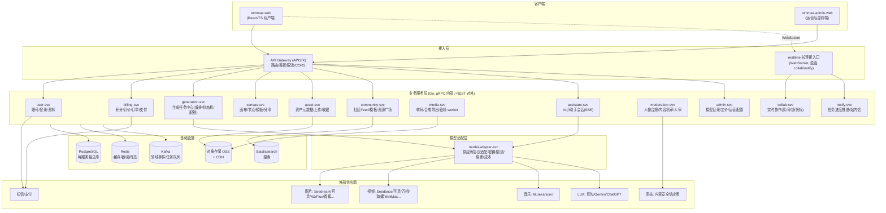

# Tommax 总体设计（01）：项目定位、功能域盘点与总体架构

> 参考蓝本：新片场 Shotlab（https://aigc.xinpianchang.com/ ，产品文档《Shotlab 使用教程》）。
> 初版目标：完整复刻 Shotlab 的产品能力（**3D 导演台除外，暂缓**），不做 MVP 裁剪。
> 技术选型：后端 Go、前端 React + TypeScript、多仓（按服务拆分）、云上 K8s 部署。

---

## 1. 产品能力盘点（复刻范围）

对照 Shotlab 文档逐章提炼，作为服务拆分的输入。每一条能力都必须能落到某个服务的职责里。

### 1.1 首页 / 发现
- 特色模型展示区：图片 / 视频 / 音乐三类模型目录，含模型介绍、标签（🔥热门、🆕新上线、即将上线）
- 作品展示区：社区 Feed（图片、视频、画布、短片、正版素材），查看作品的生成词（Prompt）与引用链
- 一键引用生成：从社区作品直接带参重建生成任务
- 图片组件 / 视频组件：模板广场，套模板上传自己的素材一键出片

### 1.2 快速生成（生成器）
- **图片**：文生图、参考生图（多参考图 / 历史创作引用）、风格转换；参数：模型、长宽比、清晰度（1K/2K/4K）、张数
- **视频**：文生视频、参考生视频（图/视频参考，多张）、首尾帧生视频（可调换首尾帧）；参数：模型、时长、分辨率、长宽比
- **音乐**：文生音乐（Mureka、sono），歌词与情绪控制
- **摄像机控制**（香蕉系模型）：相机型号 / 镜头 / 焦距 / 光圈参数化，影响出图风格
- **常用提示词**：内置模板 + 用户自定义模板的管理与快速调用

### 1.3 画布（无限画布工作流）
- 节点类型：文本、图片、视频、音频、分镜脚本、时间线（~~3D 导演台：暂缓~~，仅保留节点类型扩展位）
- 节点通用操作：双击新建、复制/粘贴/删除、多选、拖拽/缩放、连线（建立/删除）、成组（打包/解组/自动排列/组背景色）、节点标签
- 连线驱动生成：文本→图、参考图→图、图→视频、视频→视频、首尾帧→视频、组图框选引用、历史创作引用
- **图片节点快捷操作**：扩图（outpaint，11 种画幅比 + 1K/2K/4K）、重绘（inpaint，画笔/框选+提示词）、擦除、标记（涂鸦/形状/文字标注）、图片高清（超分 2K/4K）、宫格拆分（4/9/16 宫格，本地切图）、裁剪（16:9/4:3/1:1 等）、图片信息查看、打光（光源角度/颜色/亮度/轮廓光，6 种预设）、多角度（相机视角立方体/滑块/广角，生成不同拍摄视角）
- **视频节点快捷操作**：下载、生成分镜列表（视频反推脚本）、查看原视频、剪辑入口、截图当前帧
- **分镜脚本节点**：文本生成脚本（剧本→结构化分镜表）、视频生成脚本（视频理解反推：画面/人物/动作/场景/景别/运镜/时长）、表格内编辑、画幅比例设置、分镜图单条/批量生成、调序、删除、批量导出、首帧图+描述导出、分镜图生视频
- **时间线节点**：多轨剪辑（视频轨 + 独立音频轨），拼接/裁剪/删除/拖拽、音量/淡入淡出/变速、字幕自动生成、文字贴片、画布尺寸与时长自定义，导出 MP4(H.264) / WebM(VP8)
- **画布功能**：命名、左侧栏（新建内容、资源广场、节点管理[分类检索/全局搜索/自定义标签]、我的资产、导出全局预览图、使用引导、返回列表）、小地图导航（定位/缩放/聚焦）、画布智能整理（自动布局）
- **多人协作**：单画布 ≤5 人实时协作；手机号邀请；权限（可编辑/仅查看/管理者）；协作者彩色光标实时广播；节点编辑锁（"XX 正在编辑"）；画布列表协作标签、协作画布 Tab；复制链接分享
- **画布分享与公开**：分享链接（获链接可查看/引用）、公开到社区（封面自定义 + 成片预览）
- **AI 小助手**：接入豆包 2.0 / Gemini 3.1 / ChatGPT 5.5，支持图片视频上传（多模态），创意发散 / 提示词生成 / 脚本讨论，右下角全程可唤起

### 1.4 我的资产
- 历史生成内容：全部 / 图片 / 视频分类，按时间浏览
- 收藏（我的收藏）、上传记录、复用引用

### 1.5 账户与商业化
- 手机号登录注册；账户信息管理
- 积分体系：余额、明细（消耗/获取/会员赠送/购买）、订购积分（支付）、按模型+参数计价（如"立即生成（115 积分）"）

### 1.6 合规与审核
- 人像合规检测：含人像的参考图必须先过检测，才能用于 Seedance 2.0/2.5 系列（阻断式前置审核）
- 隐含要求：所有生成结果、公开发布内容需过机审（涉政/涉黄/暴恐），公开内容支持人审复核

### 1.7 模型接入（供应商侧）
- 图片模型（~10 个）：G image2、香蕉 Pro / 2.0、Seedream 5.0 lite、可灵 2.0、悠船(MJ) V7/V8、Flux 2 Pro/Max、即梦等
- 视频模型（~12 个）：Seedance 2.5/2.0/2.0 fast/2.0 mini/1.5 Pro、可灵 3.0/3.0 Omni/3.0 turbo、Happy Horse 1.0/1.1、MiniMax H3、通义万相 2.6、海螺 02 等
- 音乐模型：Mureka、sono
- LLM（小助手/分镜脚本）：豆包、Gemini、ChatGPT
- 特点：**供应商多、接口异构、上下线频繁、按次计费、限流各异** —— 这是拆出独立模型适配层的直接理由

---

## 2. 总体架构



### 2.1 四条主链路

**① 生成链路（异步任务，系统核心）**

```
前端 → gateway → generation-svc
  1. 校验参数/配额 → 调 moderation-svc（参考图人像合规，阻断式）
  2. 调 billing-svc 预扣积分（冻结）
  3. 建任务(pending) → 投递 Kafka 任务队列
generation-dispatcher(同服务 worker) → model-adapter-svc → 供应商 API
  供应商回调/轮询 → model-adapter → generation-svc 更新状态
成功: 结果文件转存 OSS → 发事件 generation.task-succeeded
  → asset-svc 落资产 → moderation-svc 机审 → notify-svc 推送前端
失败: 发事件 task-failed → billing-svc 解冻退积分 → notify 推送
```

**② 画布协作链路（实时，有状态）**

```
前端 ← WebSocket → collab-svc(房间)
  节点级操作广播(op) + 节点编辑锁 + 光标/在线状态(Redis)
  操作落库: collab-svc → canvas-svc 批量持久化(op log + snapshot)
  画布内触发生成: 前端走链路① , 任务完成事件由 collab-svc 广播到房间
```

**③ 消费/发布链路**

```
发布: 用户 → community-svc(草稿) → moderation-svc 审核 → 上架 Feed/ES
引用: Feed 作品 → 读生成参数 → 预填 generation 请求 / 画布模板整体 fork(canvas-svc)
```

**④ 剪辑导出链路（重媒体处理）**

```
时间线节点数据(canvas-svc) → media-svc 渲染任务(FFmpeg worker, K8s 独立节点池)
  → 产物入 OSS → asset-svc 落资产 → notify 推送
```

### 2.2 技术选型清单

| 关注点 | 选型 | 说明 |
|---|---|---|
| 后端语言/框架 | Go 1.22+，Kratos v2（gRPC + HTTP 双协议） | 统一脚手架，见 03 分层文档 |
| 服务间同步通信 | gRPC（契约集中 tommax-proto 仓，buf 管理） | 对外 REST/JSON 由框架同源生成 |
| 异步通信 | Kafka | 领域事件 + 生成任务队列 |
| 存储 | PostgreSQL（每服务独立库）、Redis、OSS+CDN、Elasticsearch | 画布文档存 PG jsonb + op log |
| 实时通道 | WebSocket（collab-svc / notify-svc），小助手用 SSE | |
| 网关 | APISIX | JWT 校验、限流、路由、灰度 |
| 部署 | K8s（ACK/TKE）+ Helm；media-svc 用独立 CPU 密集节点池 | |
| 可观测 | OpenTelemetry + Prometheus/Grafana + Loki + Tempo | trace 贯穿生成链路 |
| 密钥 | KMS/Vault，供应商 Key 只存在 model-adapter | |
| CI/CD | 每仓独立 GitHub Actions/GitLab CI → 镜像 → ArgoCD | |

### 2.3 明确不做 / 暂缓

- **3D 导演台**：整体暂缓（前端 Three.js 重模块）。画布节点类型枚举中预留 `node_type = director3d`，资源广场的 3D 模型素材类型预留，不实现。
- 移动端、开放平台 API、多租户：不在初版范围。

---

## 3. 文档索引

| 文档 | 内容 |
|---|---|
| `01-overview.md`（本文） | 功能盘点、总体架构、选型 |
| `02-services.md` | 服务拆分：边界、职责、数据、事件、接口域 |
| `03-layering.md` | 服务内分层：Go 目录模板、依赖规则；前端工程分层 |
| `04-conventions.md` | 编码规范（Go/TS）+ 命名规范（仓库/API/DB/MQ/错误码/Git） |
