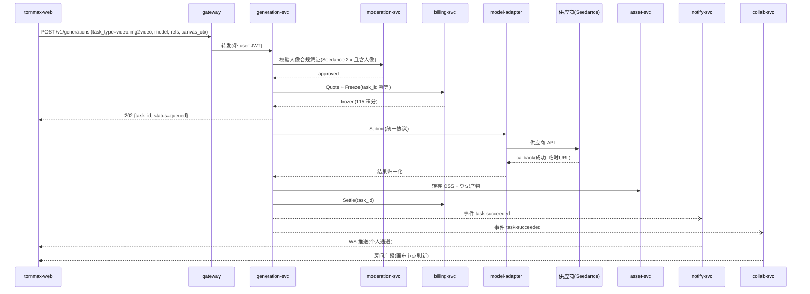

# Tommax 服务拆分设计（02）：服务清单、边界与交互契约

## 1. 拆分原则

1. **按业务能力（Bounded Context）拆分**，不按技术层拆分。每个服务对应一个业务域，独立数据库，禁止跨服务读表、跨库 join。
2. **异构变化率隔离**：模型供应商接入变化最频繁 → 独立 model-adapter；实时协作是有状态长连接 → 独立 collab；FFmpeg 渲染是资源密集型 → 独立 media worker。变化率、状态性、资源画像不同的能力不放在同一个服务里。
3. **同步调用只准从上往下**：gateway → 业务服务 → 适配层。业务服务之间横向调用仅限少量核心依赖（generation → billing/moderation），其余一律走事件解耦。禁止环形依赖。
4. **异步优先**：任何"生成/渲染/审核"都是异步任务 + 事件通知，HTTP 请求只做受理，不做等待。
5. **每个服务可独立部署、独立扩缩容、独立故障降级**。任何一个模型供应商挂掉不能影响画布编辑；协作服务挂掉不能影响单人生成。

## 2. 服务清单总览

| # | 服务 | 仓库 | 域 | 状态性 | 伸缩特征 |
|---|---|---|---|---|---|
| 1 | user-svc | tommax-user-svc | 账号身份 | 无状态 | 低 |
| 2 | billing-svc | tommax-billing-svc | 积分计费 | 无状态 | 低，强一致 |
| 3 | generation-svc | tommax-generation-svc | 生成任务中心 | 无状态+worker | 高，随任务量 |
| 4 | model-adapter-svc | tommax-model-adapter-svc | 供应商适配 | 无状态 | 高，随任务量 |
| 5 | canvas-svc | tommax-canvas-svc | 画布文档 | 无状态 | 中 |
| 6 | collab-svc | tommax-collab-svc | 实时协作 | **有状态**（房间） | 随在线数，需会话亲和 |
| 7 | asset-svc | tommax-asset-svc | 资产媒资 | 无状态 | 中 |
| 8 | media-svc | tommax-media-svc | 媒体处理 | worker 型 | CPU 密集，独立节点池 |
| 9 | community-svc | tommax-community-svc | 社区内容 | 无状态 | 中，读多写少 |
| 10 | moderation-svc | tommax-moderation-svc | 审核合规 | 无状态 | 中 |
| 11 | assistant-svc | tommax-assistant-svc | AI 小助手 | 无状态（SSE） | 中 |
| 12 | notify-svc | tommax-notify-svc | 通知推送 | 长连接 | 随在线数 |
| 13 | admin-svc | tommax-admin-svc | 运营配置 | 无状态 | 低 |
| — | tommax-web / tommax-admin-web | 前端 | — | — | 静态托管+CDN |
| — | tommax-proto | API 契约仓（buf 管理，所有服务依赖） | — | — | — |
| — | tommax-go-kit | Go 公共库（日志/错误/中间件/taskkit） | — | — | — |
| — | tommax-infra | Helm/Terraform/ArgoCD 配置 | — | — | — |

> 搜索能力（社区搜索、画布内素材检索）初版内置于 community-svc / canvas-svc 各自维护 ES 索引，不单独拆 search-svc；若后续检索场景膨胀再拆。

## 3. 各服务边界定义

每个服务按同一模板描述：**职责 / 明确不负责（边界线）/ 对外接口域 / 数据 / 事件**。

---

### 3.1 user-svc（账号身份）

**职责**
- 手机号验证码注册/登录、JWT 签发与刷新、登出
- 用户资料（昵称、头像）、账号注销
- 对内提供用户信息批量查询（gRPC）

**不负责**：积分（billing）、作品与资产（asset/community）、权限到资源粒度的判断（各资源服务自持 owner 校验）。

**接口域**：`/v1/auth/*`（登录态）、`/v1/users/*`（资料）；gRPC `user.v1.UserService`。

**数据**：`tommax_user` 库 — `users`、`user_credentials`、`sms_codes`（Redis 为主）。

**事件**：发布 `user.registered`。

---

### 3.2 billing-svc（积分与计费）

**职责**
- 积分账户：余额、免费/付费/赠送多账本，流水明细
- **计价引擎**：`(task_type, model, params) → 积分价格`。定价规则由 admin-svc 配置，billing 执行询价（文档示例："立即生成（115 积分）"）
- **预扣-结算-解冻**三段式：生成受理时冻结，成功结算，失败/超时解冻退回（保证"失败不扣费"）
- 充值订单与支付对接（微信/支付宝）、会员赠送发放

**不负责**：任务本身的状态（generation）、模型成本核算的供应商侧账单（model-adapter 记录成本，财务对账线下做）。

**接口域**：`/v1/wallet/*`（余额/明细）、`/v1/orders/*`（充值）；gRPC `billing.v1.WalletService`（`Quote`、`Freeze`、`Settle`、`Unfreeze`，幂等键 = task_id）。

**数据**：`tommax_billing` 库 — `wallets`、`wallet_ledgers`（追加式流水）、`freeze_records`、`purchase_orders`、`pricing_rules`。资金相关表一律追加式 + 事务，禁止 update 余额不写流水。

**事件**：订阅 `generation.task-succeeded / task-failed`（结算/解冻兜底，与同步调用双保险）；发布 `billing.order-paid`。

---

### 3.3 generation-svc（生成任务中心 —— 系统核心）

**职责**
- **统一生成任务模型**：受理、参数校验、任务状态机 `pending → queued → running → succeeded | failed | canceled`
- 任务类型全集（对应文档能力，见下表）
- 受理编排：调 moderation（人像合规前置，仅 Seedance 2.x/2.5 且含人像参考图时阻断）→ 调 billing 冻结积分 → 入队
- 调度 worker：并发配额（按用户/按模型/按供应商）、优先级队列、重试与超时、取消
- 结果处理：从供应商临时地址转存 OSS（委托 asset-svc 签发存储路径）、产物元数据落库、发事件
- **模型目录读侧**：向前端提供可用模型列表（名称、能力、标签🔥/🆕、参数 Schema、价格），数据源为 admin-svc 配置的下发
- 生成历史查询（"历史创作引用"的数据源）
- 提示词辅助的**前处理**：摄像机控制参数 → prompt 片段拼装；常用提示词模板 CRUD（内置 + 用户自定义）

**任务类型枚举（task_type）**

| 分组 | 类型 | 对应产品功能 |
|---|---|---|
| image | `image.text2img` / `image.ref2img` / `image.style_transfer` | 文生图 / 参考生图 / 风格转换 |
| image | `image.outpaint` / `image.inpaint` / `image.erase` | 扩图 / 重绘 / 擦除 |
| image | `image.upscale` / `image.relight` / `image.multi_view` | 图片高清 / 打光 / 多角度 |
| video | `video.text2video` / `video.img2video` / `video.video2video` / `video.flf2video` | 文生视频 / 参考生视频(图) / 参考生视频(视频) / 首尾帧 |
| audio | `audio.text2music` | 音乐生成 |
| script | `script.text2storyboard` / `script.video2storyboard` | 文本生成分镜脚本 / 视频反推分镜（LLM+视频理解） |
| script | `script.subtitle_asr` | 时间线自动字幕（ASR） |

> 宫格拆分、裁剪、标记是**纯客户端/媒体操作**，不建生成任务：宫格拆分和裁剪由前端 canvas 或 asset-svc 的简单图像处理接口完成；标记纯前端。

**不负责**：供应商协议细节（model-adapter）、产物的资产化管理（asset）、剪辑导出（media，那是确定性渲染不是 AI 生成）。

**接口域**：`/v1/generations/*`（提交/查询/取消/历史）、`/v1/models/*`（目录）、`/v1/prompt-templates/*`；gRPC `generation.v1.GenerationService`。

**数据**：`tommax_generation` 库 — `generation_tasks`（含 params jsonb、trace 字段）、`generation_outputs`、`model_catalog`（admin 下发的快照）、`prompt_templates`、`user_quotas`。

**事件**：发布 `generation.task-queued / task-started / task-progressed / task-succeeded / task-failed`；订阅 `admin.model-catalog-changed`。

---

### 3.4 model-adapter-svc（模型供应商适配层）

**职责**
- 统一内部生成协议 `Submit / Query / Cancel + Webhook 回调归一化`，屏蔽供应商差异（REST/异步回调/轮询/长任务）
- **每个供应商一个 adapter 插件**（provider 目录内插件式扩展）：Seedance、可灵、MJ(悠船)、Flux、Seedream、香蕉、通义万相、海螺、MiniMax、Mureka、sono、豆包/Gemini/ChatGPT（LLM 类供 assistant 与 script 任务用）
- 供应商密钥管理（KMS 托管，仅本服务可解密）、按供应商限流、熔断、故障转移（同能力多供应商可配备用路由）
- 供应商调用成本记录（每次调用的计量），供财务对账
- 供应商模型能力/参数映射表（内部统一参数 → 供应商参数）

**不负责**：业务语义（不知道"画布""积分"）、任务重试策略的业务决策（generation 决定重试，adapter 只如实上报失败类别：可重试/不可重试/内容违规）。

**接口域**：仅 gRPC 内部接口 `modeladapter.v1.InferenceService`；对外暴露一个供应商回调入口 `/callback/{provider}`（走独立 ingress，验签）。

**数据**：`tommax_modeladapter` 库 — `provider_calls`（调用流水/成本）、`provider_configs`。

**事件**：无对外领域事件（调用结果通过 gRPC 流/回调回传 generation）。

---

### 3.5 canvas-svc（画布文档）

**职责**
- 画布 CRUD、命名、列表（我的/协作画布 Tab、协作标签）
- **画布文档模型**：节点（7 类，`director3d` 预留）、边（连线）、组（group）、节点标签、位置/尺寸 —— 存储为 `canvas_nodes/canvas_edges` 行 + 定期快照
- 节点数据持久化（collab-svc 汇聚的 op 批量落库；单人编辑时前端直接调 REST）
- 画布模板：公开画布被"引用画布"= fork 整棵文档树（含分镜引用整体导入）
- 分享：分享链接（可查看/可引用）、公开到社区（把发布请求转交 community-svc）
- 导出全局预览图（委托 media-svc 渲染截图任务）
- 节点管理检索：按类型过滤、全局搜索（画布内，PG 内检索即可）、自定义标签
- 画布智能整理（自动布局）：布局算法在服务内实现（分层布局 + 分组聚类），输出新的节点坐标

**不负责**：实时同步与冲突（collab）、节点内的生成动作（前端直接调 generation，画布只存生成结果的资产引用）、时间线渲染（media）。

**接口域**：`/v1/canvases/*`、`/v1/canvases/{id}/nodes|edges|groups/*`、`/v1/canvases/{id}/share`；gRPC `canvas.v1.CanvasService`。

**数据**：`tommax_canvas` 库 — `canvases`、`canvas_nodes`（payload jsonb：文本内容/资产引用/分镜表/时间线编排）、`canvas_edges`、`canvas_groups`、`canvas_snapshots`、`canvas_op_logs`、`canvas_shares`、`canvas_collaborators`（成员+权限：owner/editor/viewer/manager）。

**事件**：发布 `canvas.published-requested`、`canvas.deleted`；订阅 `generation.task-succeeded`（把画布内发起的任务结果写回对应节点 payload）。

---

### 3.6 collab-svc（实时协作，有状态）

**职责**
- WebSocket 房间管理：一画布一房间，≤5 编辑者上限（可查看者不占编辑位）
- **节点级同步协议（op-based，非字符级 CRDT）**：节点/边/组的创建、移动、改值、删除以 op 广播，同节点冲突用**节点编辑锁 + 版本号（last-write-wins per node）**解决 —— 与产品行为一致（"XX 正在编辑"绿色锁标签）
- 在线状态、彩色光标位置广播（高频、只走内存不落库）
- 编辑锁的授予/释放/超时回收（Redis）
- op 缓冲与批量回写 canvas-svc（例如 200ms 合并窗口 + 定期快照触发）
- 房间内系统消息：任务完成（订阅 generation 事件后向房间广播，画布内节点出图即时刷新）

**不负责**：文档权威存储（canvas）、鉴权规则（canvas 提供成员/权限，collab 只执行）。

**部署形态**：有状态（房间在内存 + Redis 兜底），网关按 `canvas_id` 一致性哈希路由，支持房间迁移（Redis 恢复）。

**接口域**：`wss://.../collab?canvas_id=...`；内部 gRPC `collab.v1.RoomAdminService`（踢人/关房）。

**数据**：不持有独立 PG 库；Redis：`room state / locks / presence`。

**事件**：订阅 `generation.task-*`、`canvas.deleted`。

---

### 3.7 asset-svc（资产与媒资元数据）

**职责**
- 资产元数据：图片/视频/音频，来源（生成/上传/导出/截图）、尺寸/时长/格式/大小（"图片信息查看"数据源）
- 上传：OSS 直传凭证（STS）签发、回执落库、上传记录
- 我的资产页：分类（全部/图片/视频）、按时间分组浏览、收藏/取消收藏
- 生成产物登记（订阅 generation/media 事件）
- 简单同步图像操作：裁剪、宫格拆分产物落库（实际像素处理委托 media-svc 同步小接口或前端本地完成后上传）
- CDN 访问 URL 签发（私有资产带签名）

**不负责**：像素级重处理（media）、社区公开内容（community）、审核（moderation，但 asset 存储审核状态标记）。

**接口域**：`/v1/assets/*`、`/v1/uploads/*`、`/v1/favorites/*`；gRPC `asset.v1.AssetService`。

**数据**：`tommax_asset` 库 — `assets`、`asset_favorites`、`upload_records`。对象存储路径规范见 04 文档。

**事件**：订阅 `generation.task-succeeded`、`media.render-succeeded`、`moderation.result-updated`；发布 `asset.created`。

---

### 3.8 media-svc（媒体处理 worker）

**职责**
- **时间线导出渲染**：输入时间线编排 JSON（多视频轨拼接、独立音轨、音量/淡入淡出/变速、字幕、文字贴片、自定义画幅与时长）→ FFmpeg 合成 → MP4(H.264)/WebM(VP8)
- 通用媒资处理：转码、视频截帧（"截图"功能）、缩略图、画布全局预览图渲染（headless 渲染或拼图）、GIF/首帧提取
- 渲染任务队列（Kafka）+ 进度上报（导出进度条）
- ASR 字幕：调 model-adapter 的 ASR 能力，产物 SRT 回填

**不负责**：AI 生成（generation）、资产元数据（asset，media 只回传产物路径）。

**部署形态**：worker 无 HTTP 面（仅健康检查+内部受理 gRPC），跑在独立 CPU 节点池，按队列深度 HPA/KEDA 扩缩。

**接口域**：gRPC `media.v1.RenderService`（SubmitRender/QueryRender/CancelRender）。

**数据**：`tommax_media` 库 — `render_tasks`。

**事件**：发布 `media.render-progressed / render-succeeded / render-failed`。

---

### 3.9 community-svc（社区与内容分发）

**职责**
- 发现页 Feed：作品流（图片/视频/短片分类：图片组件/视频组件/广告片/剧情短片/情绪短片/视觉短片）、正版素材区
- 作品发布（个人作品/公开画布上架）：草稿 → 审核中 → 上架/驳回 状态机
- 作品详情：生成词（Prompt）与参数展示、"一键引用"跳转参数包
- **模板广场**（图片组件/视频组件）：模板=公开画布的受控视图，"引用画布"触发 canvas-svc fork
- **资源广场**（人物资产）：人物卡（面部特写/面部九宫格/头部三视图/全身三视图/人物板/人物场景），点击应用到画布（3D 模型素材类型预留不做）
- 点赞、收藏、浏览计数；社区搜索（ES）

**不负责**：内容审核判断（moderation）、画布 fork 的文档操作（canvas）。

**接口域**：`/v1/feed/*`、`/v1/works/*`、`/v1/templates/*`、`/v1/resource-plaza/*`。

**数据**：`tommax_community` 库 — `works`、`work_stats`、`work_likes`、`templates`、`character_assets`；ES 索引 `works`。

**事件**：发布 `community.work-submitted`；订阅 `moderation.result-updated`（上架/驳回）、`canvas.published-requested`。

---

### 3.10 moderation-svc（审核与合规）

**职责**
- **人像合规检测**（阻断式同步接口）：参考图人脸检测 + 合规校验，产出 `approved/rejected` 凭证（带 TTL），generation 受理 Seedance 2.x 任务时校验凭证
- 内容机审流水线（异步）：文本（prompt）、图片、视频（抽帧）送供应商机审，riskLevel 落库
- 人审工作台后端：待审队列、通过/驳回、封禁素材
- 审核策略配置：哪些场景强审（公开发布）、哪些抽审（私有生成）

**不负责**：业务处置动作本身（下架由 community 订阅事件执行；资产标记由 asset 执行）。

**接口域**：`/v1/moderation/portrait-check`（前端直用，上传参考图预检）；gRPC `moderation.v1.ModerationService`；管理端接口挂 admin 域。

**数据**：`tommax_moderation` 库 — `moderation_records`、`portrait_check_records`、`policies`。

**事件**：发布 `moderation.result-updated`；订阅 `generation.task-succeeded`、`community.work-submitted`、`asset.created`（按策略触发机审）。

---

### 3.11 assistant-svc（AI 小助手）

**职责**
- 会话管理：多轮对话、历史会话、上下文窗口管理
- 多模型切换（豆包 2.0 / Gemini 3.1 / ChatGPT 5.5），多模态输入（图片/视频引用 asset）
- SSE 流式输出；预置技能 prompt（创意发散/提示词生成/脚本讨论）
- 画布上下文注入：可携带当前画布/节点摘要作为对话上下文

**不负责**：LLM 供应商调用细节（走 model-adapter 的 LLM 通道）、把结果写回画布（前端确认后调 canvas/generation）。

**接口域**：`/v1/assistant/conversations/*`、`/v1/assistant/chat`（SSE）。

**数据**：`tommax_assistant` 库 — `conversations`、`messages`。

---

### 3.12 notify-svc（通知推送）

**职责**
- 用户级 WebSocket/SSE 推送通道（区别于 collab 的房间通道）：任务完成/失败、审核结果、协作邀请、系统公告
- 站内信收件箱（未读数、已读）
- 推送模板管理

**接口域**：`wss://.../notify`、`/v1/notifications/*`。

**数据**：`tommax_notify` 库 — `notifications`。

**事件**：订阅 `generation.task-*`、`media.render-*`、`moderation.result-updated`、`billing.order-paid` 等。

---

### 3.13 admin-svc（运营配置后台）

**职责**
- **模型目录管理**：模型上下线、名称/介绍/核心亮点文案、标签（🔥/🆕/即将上线）、参数 Schema、能力映射（对应 adapter 的 provider+model）、展示排序
- 定价规则管理（下发 billing）
- 首页运营位、模板/资源广场上架管理、正版素材管理
- 人审工作台前端的后端聚合、用户管理（封禁）
- 运营数据看板聚合查询

**接口域**：`/admin/v1/*`（独立鉴权：运营账号 + RBAC）。

**数据**：`tommax_admin` 库 — 配置类表 + 操作审计日志。

**事件**：发布 `admin.model-catalog-changed`、`admin.pricing-changed`。

---

## 4. 关键交互时序

### 4.1 画布内"参考图 → 生成视频"（含合规与计费）



### 4.2 失败退款路径

`供应商失败/超时 → adapter 上报失败类别 → generation 判定(重试N次后)task-failed → 调 billing.Unfreeze（+事件兜底对账）→ notify 推送"生成失败，积分已退回"`

### 4.3 多人协作编辑

```
A,B 进入画布 → WS 接入 collab(按 canvas_id 哈希到同一实例)
A 选中节点 n1 → collab 授予 n1 编辑锁 → 房间广播 lock(n1, A)
B 界面上 n1 显示 "A 正在编辑"
A 拖动/改值 → op 广播(B 实时可见) → collab 200ms 合并批量写 canvas-svc
A 释放/断线超时 → 锁回收广播
```

## 5. 服务间依赖矩阵（同步调用）

| 调用方 ↓ 被调方 → | user | billing | generation | model-adapter | canvas | asset | media | moderation | community |
|---|---|---|---|---|---|---|---|---|---|
| gateway | ✅ | ✅ | ✅ | — | ✅ | ✅ | — | ✅(人像预检) | ✅ |
| generation | — | ✅ | — | ✅ | — | ✅(转存) | — | ✅(凭证校验) | — |
| canvas | — | — | — | — | — | ✅(引用校验) | ✅(预览图) | — | — |
| collab | — | — | — | — | ✅(权限/落库) | — | — | — | — |
| assistant | — | ✅(若按次计费) | — | ✅(LLM) | ✅(读上下文) | ✅ | — | — | — |
| community | — | — | ✅(读参数包) | — | ✅(fork) | ✅ | — | — | — |
| media | — | — | — | ✅(ASR) | — | ✅(产物登记可事件化) | — | — | — |

其余交互一律通过 Kafka 事件。**红线：billing、user 不允许反向调用任何业务服务；model-adapter 不允许调用任何业务服务。**
